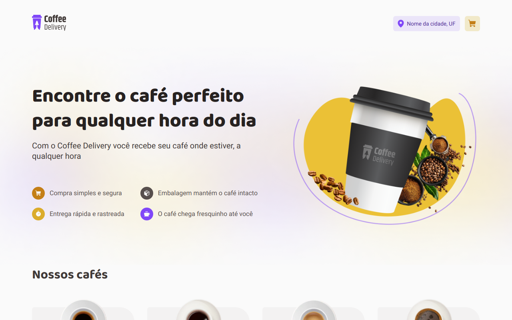

<h1 align="center">
    A coffee ecommerce with a functional checkout
</h1>

  
   
  
   
    

    <a href="https://coffee-delivery-ecommerce.vercel.app/" target="_blank">Click here to see the live demo!</a>&nbsp;&nbsp;&nbsp;

## :rocket: User stories
- User can add products into the cart;
- User can increase and decrease product quantity into the cart;
- User can access the cart;
- User can search for his address through postal code;

## :rocket: Functionalities
- Cart info is stored in the localStorage;
- Address is automatically filled through ViaCEP API request;
- After the cart contains the product, user can only increase its quantity;

## :rocket: Technologies

- [ReactJS](https://reactjs.org/)
- [ViteJS](https://vitejs.dev/)
- [TypeScript](https://www.typescriptlang.org/)
- [LocalStorage API](https://developer.mozilla.org/pt-BR/docs/Web/API/Window/localStorage)
- [Immer](https://immerjs.github.io/immer/)
- [AutoAnimate](https://auto-animate.formkit.com/)
- [Phosphor Icons](https://phosphoricons.com/)
- [Styled Components](https://styled-components.com/)
- [React Toastify](https://www.npmjs.com/package/react-toastify)
- [React Router](https://reactrouter.com/en/main)
- [ViaCEP API](https://viacep.com.br/)

Made with ♥ by Carlos :wave: [Get in touch!](https://www.linkedin.com/in/kdumagalhaes/)
